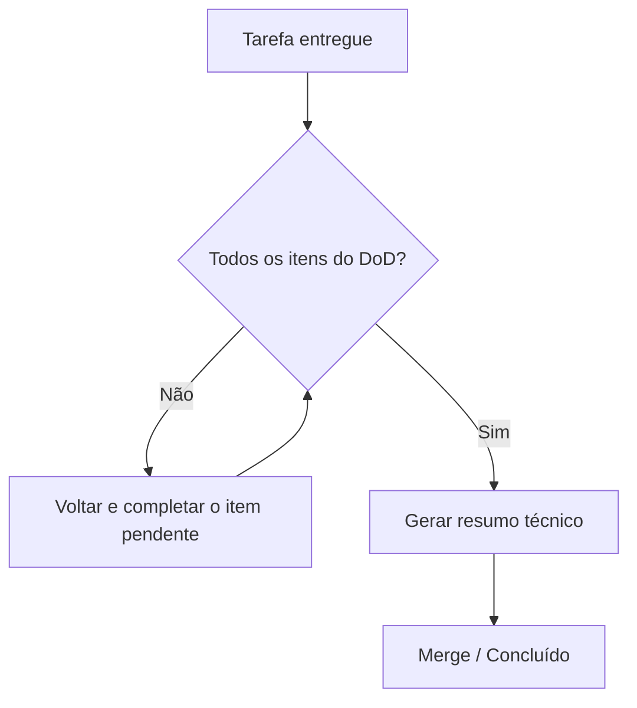

# Definition of Done (DoD)

> [!abstract] Objetivo
> Definir, de forma única e não negociável, **quando uma tarefa está concluída** no BeautyOS.
> Enquanto **qualquer** item abaixo não estiver atendido, a tarefa **não** está pronta.

Complementa a [Engineering Constitution](CLAUDE.md) e o
[Checklist de feature](.claude/checklists/feature.md). É aplicado a toda entrega — feature,
correção ou mudança de documentação.

## Critérios obrigatórios

> [!danger] Todos os itens são obrigatórios. "Quase pronto" = não pronto.

- [ ] **Código implementado** — atende ao requisito, respeita as fronteiras de
      [módulo/context](docs/architecture/modules.md) e os padrões (SOLID, Clean Arch, DDD).
- [ ] **Testes criados/atualizados** — inclui **isolamento de tenant** quando aplicável
      ([estratégia de testes](docs/testing/testing-strategy.md)); suíte verde na CI.
- [ ] **Vault de documentação atualizado** — no mesmo PR, seguindo
      [docs-as-code](docs/CONTRIBUTING-DOCS.md) e a política SSOT.
- [ ] **ADR criada** — quando houve decisão arquitetural ([template](docs/decisions/template.md),
      [índice](docs/decisions/README.md)).
- [ ] **Diagramas Mermaid revisados** — refletem o estado atual (arquitetura, fluxo, domínio, eventos).
- [ ] **Backlinks e MOCs atualizados** — links internos válidos; mapas de conteúdo coerentes.
- [ ] **Changelog atualizado** — a mudança está registrada em [CHANGELOG.md](CHANGELOG.md).
- [ ] **Impacto em outros módulos analisado** — dependências e eventos
      ([context map](docs/architecture/modules.md), [eventos](docs/architecture/events.md)).
- [ ] **Segurança e performance revisadas** — authz no servidor, LGPD, índices por `tenant_id`,
      sem N+1 ([segurança](docs/security/security.md), [multi-tenant](docs/architecture/multi-tenant.md)).
- [ ] **Resumo técnico gerado** — o que mudou, por quê, arquivos afetados, riscos e pendências.

## Fluxo de aceitação

## Boas práticas

- Tratar o DoD como **gate**, não como sugestão: revisor barra PR que não o cumpra.
- Preferir PRs pequenos — o DoD é mais fácil de satisfizer em mudanças coesas.
- Quando um item comprovadamente não se aplica, **declarar explicitamente** o motivo no resumo.

## Más práticas

- ❌ Marcar item sem tê-lo realmente feito ("marcar por marcar").
- ❌ Adiar documentação/testes "para depois" — depois vira débito técnico.
- ❌ Concluir com backlink quebrado ou Mermaid desatualizado.

## Impacto

Um DoD explícito torna a qualidade **verificável e repetível**, reduzindo regressões e débito ao
longo dos cinco anos de vida do produto.

## Evolução futura

- Automatizar itens verificáveis na CI: suíte de testes, _lint_ de links quebrados, presença de
  frontmatter e de seções obrigatórias, validação de blocos Mermaid.

## Referências

- [Engineering Constitution (CLAUDE.md)](CLAUDE.md) · [Checklist de feature](.claude/checklists/feature.md)
- [Docs-as-Code](docs/CONTRIBUTING-DOCS.md) · [ADRs](docs/decisions/README.md)
