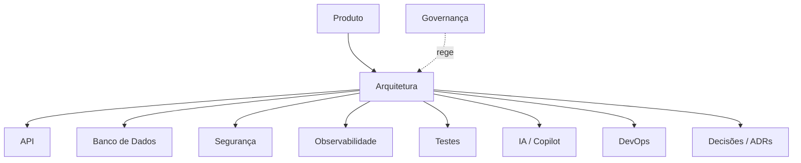

# 🏠 BeautyOS — Mapa do Vault

> [!abstract] O que é isto
> **MOC raiz** (Map of Content) do Vault de documentação — a *home note* do Obsidian. Enquanto
> o [README](README.md) é o **índice plano** de navegação, este MOC mostra **como as áreas se
> relacionam** e serve de ponto de partida para explorar o conhecimento por vínculos e backlinks.

## Mapa de relações

## Áreas do Vault

- 🎯 **Produto** — [Visão](product/vision.md)
- 🏛️ **Arquitetura** — [MOC de Arquitetura](architecture/_MOC.md) *(overview, módulos, multi-tenant, domínio, eventos)*
- 🔌 **API** — [Diretrizes de API](api/api_guidelines.md)
- 🗄️ **Banco de Dados** — [Modelagem](database/modeling.md)
- 🔐 **Segurança** — [Segurança & LGPD](security/security.md)
- 📈 **Observabilidade** — [Logs, métricas, tracing, SLOs](observability/observability.md)
- 🧪 **Testes** — [Estratégia de testes](testing/testing-strategy.md)
- 🚀 **DevOps** — [Deploy & CI/CD](devops/deploy.md)
- 🤖 **IA** — [Copilot / IA](ai/copilot.md)
- 🧭 **Decisões** — [Índice de ADRs](decisions/README.md)

## Governança (fora do Vault, no root do repo)

- 📜 [Engineering Constitution — CLAUDE.md](../CLAUDE.md)
- ✅ [Definition of Done](../DEFINITION_OF_DONE.md)
- 🧾 [Changelog](../CHANGELOG.md)

## Base de conhecimento transversal

- 📖 [Glossário / Linguagem Ubíqua](glossary.md)
- ✍️ [Padrão docs-as-code](CONTRIBUTING-DOCS.md)
- 🧱 [Template de documento](templates/document-template.md)

## Tags principais

`#arquitetura` · `#multi-tenant` · `#seguranca` · `#api` · `#dominio` · `#eventos` ·
`#observabilidade` · `#testes` · `#ia` · `#adr` · `#moc` · `#governanca`

> [!tip] Convenção de MOC
> Cada área ganha seu próprio `_MOC.md` **quando passa a ter dois ou mais documentos**. Áreas com
> um único documento são acessadas diretamente por este MOC raiz.
