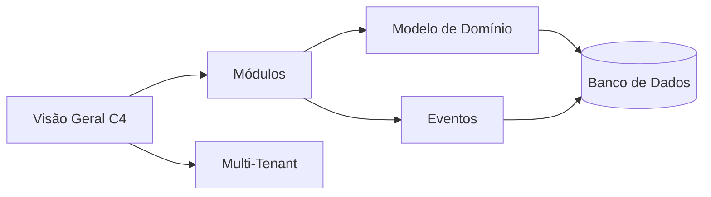

# 🏛️ Arquitetura — Mapa de Conteúdo

> [!abstract] Escopo
> Mapa da área de **Arquitetura** do BeautyOS. Ponto de entrada para entender estilo, fronteiras,
> isolamento, domínio e integração entre módulos. Parte do [MOC raiz](../_MOC.md).

## Documentos

- 🗺️ [Visão Geral (C4)](overview.md) — estilo (monólito modular), stack e diagramas C4.
- 🧩 [Módulos / Bounded Contexts](modules.md) — **SSOT** da lista canônica e context map.
- 🏢 [Multi-Tenant](multi-tenant.md) — **SSOT** do isolamento por Empresa (`tenant_id` + RLS).
- 🧠 [Modelo de Domínio](domain-model.md) — agregados, entidades e invariantes (DDD).
- 📣 [Catálogo de Eventos](events.md) — domain events e Outbox Pattern.

## Como se conectam

## Decisões que fundamentam esta área

- [ADR-0001 — Monólito Modular](../decisions/0001-monolith-modular.md)
- [ADR-0002 — PostgreSQL](../decisions/0002-postgresql-primary-db.md)
- [ADR-0003 — Tenancy: shared-DB + RLS](../decisions/0003-tenancy-shared-db-rls.md)
- [ADR-0004 — Lista canônica de módulos](../decisions/0004-canonical-modules.md)
- [ADR-0005 — Outbox Pattern](../decisions/0005-outbox-pattern.md)

## Relacionados (fora da área)

[Segurança](../security/security.md) · [API](../api/api_guidelines.md) ·
[Banco de Dados](../database/modeling.md) · [Observabilidade](../observability/observability.md) ·
[Glossário](../glossary.md)

## Tags

`#arquitetura` · `#multi-tenant` · `#dominio` · `#eventos` · `#adr`
