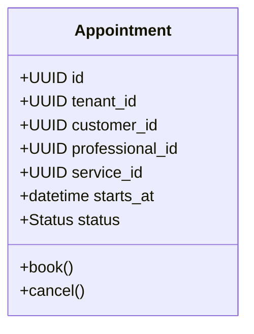

# Modelo de Domínio

> **Status:** Rascunho estruturado · **Dono:** Arquitetura · **Última atualização:** 2026-07-24

## Objetivo

Descrever os **agregados**, entidades e invariantes de cada bounded context, dando base ao
código (DDD) e à modelagem de dados.

## Contexto

Complementa [modules.md](modules.md) (fronteiras) e [events.md](events.md) (comunicação). Cada
agregado é a unidade de consistência transacional; referências entre contextos usam **ID**, não
objeto direto.

## Responsabilidades

- Definir a raiz de agregado, invariantes e ciclo de vida por contexto.
- Servir de fonte para o schema ([database/modeling.md](../database/modeling.md)).

## Agregados por contexto (visão inicial)

| Context | Agregado (raiz) | Entidades/VOs principais | Invariantes-chave |
|---|---|---|---|
| `tenant` | `Company` | `Branch`, `Subscription` | Empresa ativa exige plano válido. |
| `staff` | `Professional` | `WorkSchedule`, `Specialty` | Jornada não sobrepõe. |
| `catalog` | `Service` | `Price`, `Duration` | Duração > 0; preço ≥ 0. |
| `scheduling` | `Appointment` | `Slot`, `Block` | Sem conflito de horário por profissional. |
| `crm` | `Customer` | `Note`, `Segment` | Cliente único por Empresa (dedupe). |
| `finance` | `Ticket` | `Payment`, `LineItem` | Total = Σ itens; não fecha em aberto. |
| `commissions` | `Commission` | `Rule`, `Statement` | Comissão só sobre item concluído/pago. |
| `inventory` | `Product` | `StockMovement` | Saldo ≥ 0 (ou permite negativo configurável). |

> As demais raízes (`marketing`, `marketplace`, `notifications`, `ai`) serão detalhadas na
> próxima iteração — ver [Pendências](#evolução-futura).

## Exemplo (diagrama de agregado — Appointment)

## Boas práticas

- Referência entre agregados por **ID** (`customer_id`), nunca objeto de outro contexto.
- Invariantes no domínio, não em validação de API.
- Transação = 1 agregado; efeitos entre agregados via **evento** ([events.md](events.md)).

## Más práticas

- ❌ Agregado gigante que abrange vários contextos.
- ❌ Consistência entre agregados dentro de uma mesma transação distribuída.

## Impacto

Fronteiras de agregado bem escolhidas reduzem contenção e simplificam a extração futura de
serviços.

## Evolução futura

- Detalhar agregados de `marketing`, `marketplace`, `notifications`, `ai`.
- Especificar máquinas de estado (Appointment, Ticket) e VOs de dinheiro (Money).

## Referências

- [Módulos](modules.md) · [Eventos](events.md) · [Modelagem de Banco](../database/modeling.md)
- Vaughn Vernon, _Implementing Domain-Driven Design_.
