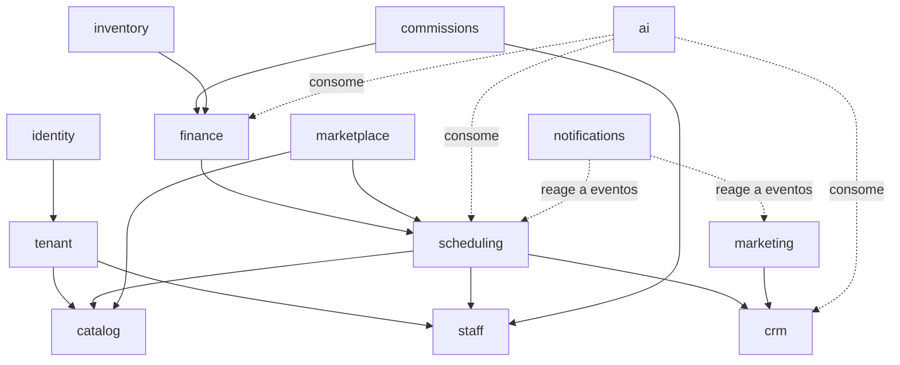

# Módulos / Bounded Contexts

> **Status:** Ativo · **Dono:** Arquitetura · **Última atualização:** 2026-07-24
> **SSOT:** Lista canônica de módulos. Definida por [ADR-0004](../decisions/0004-canonical-modules.md).
> Nenhum outro documento deve redefinir esta lista — apenas referenciá-la.

## Objetivo

Estabelecer os **bounded contexts** do BeautyOS, suas responsabilidades, fronteiras e
dependências permitidas, dentro do monólito modular ([ADR-0001](../decisions/0001-monolith-modular.md)).

## Contexto

O produto é organizado em módulos que mapeiam contextos de domínio do mercado da beleza. Cada
módulo tem alta coesão interna e baixo acoplamento externo, comunicando-se por contratos e
**domain events** ([events.md](events.md)), nunca por acesso direto a dados de outro módulo.

## Responsabilidades por módulo

| Módulo | Context | Responsabilidade | Não é responsável por |
|---|---|---|---|
| Identidade/Auth | `identity` | Autenticação, usuários, sessões, tokens, MFA. | Papéis de negócio da Empresa (fica em `tenant`). |
| Tenant/Empresas | `tenant` | Empresas, filiais, planos/assinaturas, RBAC por Empresa. | Autenticação (fica em `identity`). |
| Catálogo de Serviços | `catalog` | Serviços, durações, preços, categorias. | Estoque de produtos (fica em `inventory`). |
| Profissionais | `staff` | Profissionais, especialidades, jornada de trabalho. | Cálculo de comissão (fica em `commissions`). |
| Agenda/Booking | `scheduling` | Agendamentos, disponibilidade, bloqueios, fila. | Cobrança do atendimento (fica em `finance`). |
| CRM | `crm` | Clientes finais, histórico, segmentação, notas. | Campanhas de marketing (fica em `marketing`). |
| Financeiro/Pagamentos | `finance` | Comandas, contas a pagar/receber, pagamentos. | Comissão de profissional (fica em `commissions`). |
| Comissões | `commissions` | Regras, cálculo e fechamento de comissões. | Pagamento em si (fica em `finance`). |
| Estoque | `inventory` | Produtos, entradas/saídas, saldo, consumo em serviços. | Preço de serviço (fica em `catalog`). |
| Marketing/Fidelidade | `marketing` | Campanhas, fidelidade, promoções, cupons. | Envio técnico (fica em `notifications`). |
| IA/Copilot | `ai` | Copilotos, agentes, RAG, automações, insights. | Regras de cada domínio (consome, não redefine). |
| Marketplace | `marketplace` | Descoberta e agendamento público Empresa↔Cliente. | Agenda interna (delega a `scheduling`). |
| Notificações | `notifications` | E-mail, SMS, push, WhatsApp; preferências e templates. | Decidir *quando* notificar (quem dispara é o dono do evento). |

## Mapa de contextos (dependências permitidas)

> Regra: dependências fluem por **eventos** (assíncrono) ou **contratos** (síncrono somente
> quando indispensável). Setas indicam "reage a / consome de".

## Exemplos

- **Consumo de produto em serviço:** ao fechar uma Comanda em `finance`, o evento
  `TicketClosed` é consumido por `inventory` (baixa de estoque) e por `commissions` (cálculo).
- **Marketplace agenda:** `marketplace` cria um Agendamento delegando ao caso de uso de
  `scheduling`, sem manter agenda própria.

## Boas práticas

- Cada módulo expõe uma **API pública interna** (casos de uso) e mantém o resto privado.
  Na implementação, essa API pública é realizada por um `contracts.py` (funções + DTOs simples);
  outros módulos consomem os contratos, **nunca** o model ORM alheio. Ex.: `scheduling` valida
  serviço/profissional via `catalog.contracts` e `staff.contracts`.
- Comunicação entre módulos preferencialmente **assíncrona via eventos**.
- Novos módulos entram primeiro aqui e no [ADR-0004](../decisions/0004-canonical-modules.md).

## Más práticas

- ❌ `JOIN` entre tabelas de módulos diferentes.
- ❌ Importar modelos ORM de outro módulo.
- ❌ Colocar lógica de um domínio dentro de outro (ex.: comissão dentro de `finance`).

## Impacto

- **Manutenção/escala:** fronteiras nítidas permitem extrair um módulo para microsserviço sem
  reescrever consumidores (contrato de evento estável).
- **Roadmap:** as fases de entrega seguem esta lista (ver `ROADMAP`).

## Evolução futura

- Candidatos naturais a extração para serviço: `notifications`, `ai`, `marketplace` (cargas e
  ciclos de vida próprios).
- Read models dedicados para `ai`/relatórios quando houver ganho.

## Referências

- [ADR-0004: Lista canônica de módulos](../decisions/0004-canonical-modules.md)
- [Modelo de Domínio](domain-model.md) · [Catálogo de Eventos](events.md) · [Glossário](../glossary.md)
