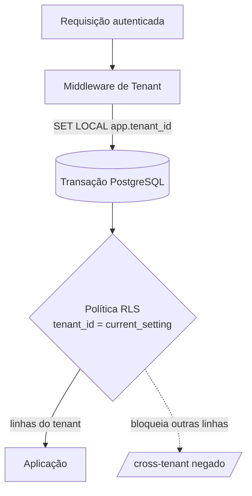

# Multi-Tenant — Isolamento de Dados

> **Status:** Ativo · **Dono:** Arquitetura · **Última atualização:** 2026-07-24
> **SSOT:** Este é o **único** documento que define a estratégia de tenancy. Demais documentos
> (banco, segurança, regras de negócio) devem **referenciar** este, não redefini-lo.

## Objetivo

Definir como o BeautyOS garante **isolamento completo dos dados de cada Empresa (tenant)** ao
mesmo tempo em que escala para centenas de milhares de tenants com custo operacional viável.

## Contexto

Cada Empresa é um **tenant** (ver [glossário](../glossary.md)). A estratégia adotada
([ADR-0003](../decisions/0003-tenancy-shared-db-rls.md)) é **banco compartilhado com `tenant_id`
em toda entidade de negócio, reforçado por Row-Level Security (RLS) do PostgreSQL**. É a decisão
central de segurança e escala do produto.

## Responsabilidades

- **Middleware de tenant:** resolver o tenant da requisição (a partir do token/subdomínio) e
  definir o contexto de tenant para a transação.
- **Camada de dados:** garantir `tenant_id` em toda tabela de negócio e escopo automático nas
  queries.
- **PostgreSQL (RLS):** rede de segurança — impedir leitura/escrita fora do tenant corrente,
  mesmo que a aplicação esqueça o filtro.
- **NÃO** é responsabilidade daqui: tabelas globais de plataforma (planos, catálogos públicos)
  que, por definição, não pertencem a um tenant.

## Modelo



### Camadas de defesa (defesa em profundidade)

1. **Autenticação** define o usuário e a(s) Empresa(s) a que pertence.
2. **Middleware** define `app.tenant_id` da sessão via `SET LOCAL` no início da transação.
3. **Escopo de aplicação:** todo repositório filtra por `tenant_id` (manager padrão com escopo).
4. **RLS no banco:** política `USING (tenant_id = current_setting('app.tenant_id')::uuid)` como
   rede de segurança final.

## Exemplos

### Coluna e índice

```sql
-- Toda tabela de negócio começa com tenant_id e o inclui nos índices.
CREATE TABLE appointment (
    id           uuid PRIMARY KEY DEFAULT gen_random_uuid(),
    tenant_id    uuid NOT NULL REFERENCES company(id),
    customer_id  uuid NOT NULL,
    professional_id uuid NOT NULL,
    starts_at    timestamptz NOT NULL,
    -- ...
);
CREATE INDEX idx_appointment_tenant_start ON appointment (tenant_id, starts_at);
```

### Política RLS

```sql
ALTER TABLE appointment ENABLE ROW LEVEL SECURITY;
CREATE POLICY tenant_isolation ON appointment
    USING (tenant_id = current_setting('app.tenant_id')::uuid)
    WITH CHECK (tenant_id = current_setting('app.tenant_id')::uuid);
```

### Definição do tenant na sessão (por requisição)

```python
# Middleware: executa dentro da transação da requisição
with connection.cursor() as cur:
    cur.execute("SET LOCAL app.tenant_id = %s", [request.tenant_id])
```

## Boas práticas

- `tenant_id` é **sempre** a primeira coluna de índices compostos.
- Usar `SET LOCAL` (escopo da transação), nunca `SET` global de conexão em pool.
- Conta de aplicação **sem** privilégio `BYPASSRLS`.
- Testes automatizados de isolamento: tentar ler dado de outro tenant deve retornar vazio.

## Más práticas

- ❌ Passar `tenant_id` em query string ou confiar no cliente para informá-lo.
- ❌ Query sem escopo de tenant "porque a RLS protege" — mantenha as duas camadas.
- ❌ Reaproveitar conexão do pool sem redefinir/limpar o `app.tenant_id`.
- ❌ Rodar jobs/relatórios com credencial administrativa que ignore RLS sem escopo explícito.

## Impacto

- **Segurança:** vazamento cross-tenant é o principal risco do produto — as duas camadas o
  mitigam (ver [segurança](../security/security.md)).
- **Escalabilidade:** um conjunto de migrações e um pool para todos os tenants.
- **Performance:** exige índices iniciando por `tenant_id`; tabelas de alto volume podem ser
  particionadas por `tenant_id` (ver [modelagem](../database/modeling.md)).

## Evolução futura

- **Particionamento** por `tenant_id` (ou hash) em tabelas de alto volume.
- **Sharding**/infra dedicada para tenants enterprise, sem mudar o modelo lógico.
- Cotas e _rate limiting_ por tenant para conter "vizinho barulhento".

## Referências

- [ADR-0003: Tenancy shared-DB + RLS](../decisions/0003-tenancy-shared-db-rls.md)
- [ADR-0002: PostgreSQL](../decisions/0002-postgresql-primary-db.md)
- [Segurança](../security/security.md) · [Modelagem de Banco](../database/modeling.md)
- [PostgreSQL Row Security](https://www.postgresql.org/docs/current/ddl-rowsecurity.html)
