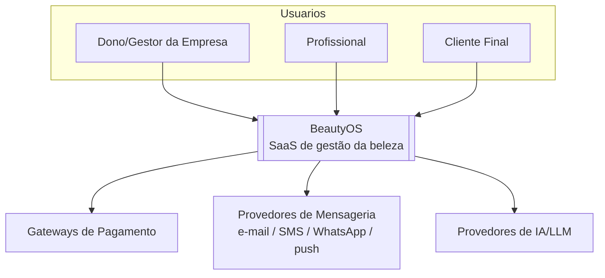
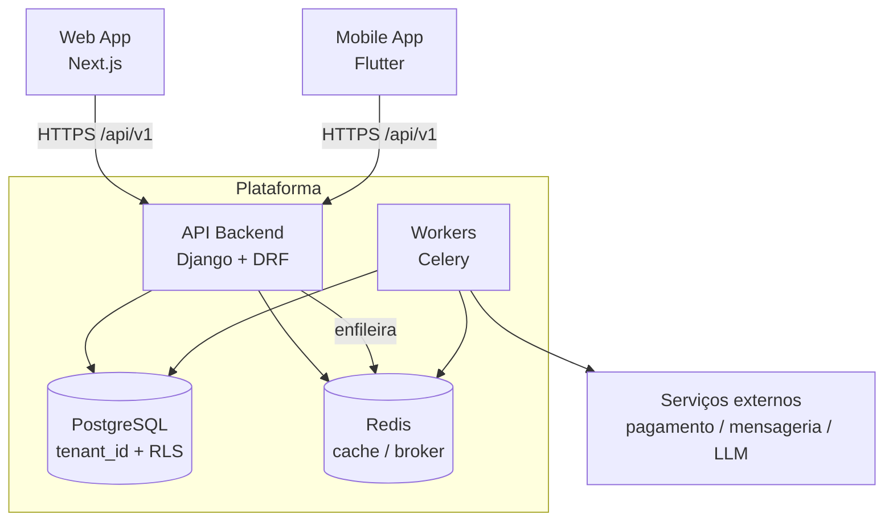
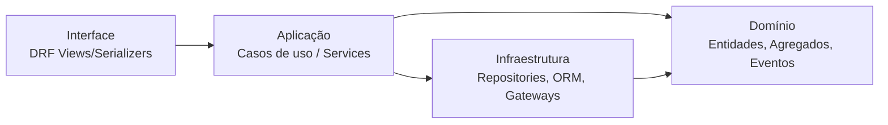

# Visão Geral da Arquitetura

> **Status:** Ativo · **Dono:** Arquitetura · **Última atualização:** 2026-07-24

## Objetivo

Descrever a arquitetura do BeautyOS em alto nível — estilo, stack e limites — para orientar
qualquer decisão de implementação. É o ponto de entrada técnico do projeto.

## Contexto

O BeautyOS é um SaaS **multi-tenant, modular e API-first** para o mercado da beleza, projetado
para escalar globalmente. A topologia é um **Monólito Modular** ([ADR-0001](../decisions/0001-monolith-modular.md)):
uma aplicação implantável, dividida em módulos com fronteiras explícitas, comunicando-se por
contratos e **domain events**. Essa escolha maximiza velocidade e simplicidade operacional
agora, sem impedir a extração futura de serviços.

## Responsabilidades

- **Backend (Django + DRF):** regras de negócio, API REST, orquestração de casos de uso.
- **Workers (Celery + Redis):** tarefas assíncronas, relay do Outbox, agendamentos.
- **Frontend Web (Next.js):** painel de gestão da Empresa.
- **Mobile (Flutter):** app para profissionais e clientes.
- **PostgreSQL:** armazenamento primário e isolamento por tenant (RLS).
- **Fora de escopo deste documento:** detalhes de cada módulo (ver [modules.md](modules.md)),
  isolamento de dados (ver [multi-tenant.md](multi-tenant.md)).

## Stack (fonte única de verdade)

| Camada | Tecnologia | Notas |
|---|---|---|
| API/Backend | Django + Django REST Framework | Monólito modular, API-first. |
| Assíncrono | Celery + Redis | Filas, agendamentos, relay do Outbox. |
| Banco primário | PostgreSQL | ACID, RLS, JSONB, pgvector ([ADR-0002](../decisions/0002-postgresql-primary-db.md)). |
| Cache/Broker | Redis | Cache, rate limiting, broker do Celery. |
| Web | Next.js (React) | Painel de gestão. |
| Mobile | Flutter | Profissionais e clientes. |
| Empacotamento | Docker | Paridade dev/prod ([12-Factor](../devops/deploy.md)). |
| CI/CD | GitHub Actions | Ambientes dev/hml/prod. |

## C4 — Nível 1: Contexto do Sistema

## C4 — Nível 2: Contêineres

## Estilo arquitetural

Cada módulo segue **Clean Architecture / camadas** com DDD:

- **Domínio** não depende de framework. **Aplicação** orquestra casos de uso. **Infraestrutura**
  implementa repositórios (ORM) e gateways externos. **Interface** expõe a API.
- Módulos se comunicam por **domain events** ([events.md](events.md)) e contratos — nunca
  acessando tabelas de outro módulo.

## Exemplos

- **Fluxo de agendamento:** `Web/Mobile → API (caso de uso BookAppointment) → Domínio valida
  disponibilidade → Repository persiste + grava evento `AppointmentBooked` na Outbox → Worker
  faz relay → Notificações envia confirmação e CRM atualiza histórico.`

## Boas práticas

- Respeitar as fronteiras de módulo e o _context map_ de [modules.md](modules.md).
- Toda escrita que gere efeito colateral entre módulos usa **Outbox + evento**
  ([ADR-0005](../decisions/0005-outbox-pattern.md)).
- Manter a API como contrato estável e versionado ([api_guidelines.md](../api/api_guidelines.md)).

## Más práticas

- ❌ Um módulo consultar/alterar tabelas de outro módulo diretamente.
- ❌ Colocar regra de negócio em views/serializers (deve ficar no domínio/aplicação).
- ❌ Chamada síncrona entre módulos onde um evento assíncrono resolveria (aumenta acoplamento).

## Impacto

- **Escalabilidade:** monólito escala horizontalmente por réplicas; contextos com carga própria
  podem ser extraídos depois sem reescrita, graças às fronteiras e ao Outbox.
- **Manutenção/Testabilidade:** baixo acoplamento e alta coesão por módulo.
- **Performance:** um banco simplifica consistência; pontos quentes tratados por índices e
  particionamento ([modelagem](../database/modeling.md)).

## Evolução futura

- Extração de bounded contexts de alta carga para microsserviços (novo ADR quando ocorrer).
- Read models/CQRS **apenas** onde houver ganho comprovado.
- Broker externo (ex.: Kafka/RabbitMQ) alimentado pelo mesmo Outbox.

## Referências

- ADRs [0001](../decisions/0001-monolith-modular.md), [0002](../decisions/0002-postgresql-primary-db.md),
  [0003](../decisions/0003-tenancy-shared-db-rls.md), [0005](../decisions/0005-outbox-pattern.md)
- [Módulos](modules.md) · [Multi-Tenant](multi-tenant.md) · [C4 Model](https://c4model.com/)
