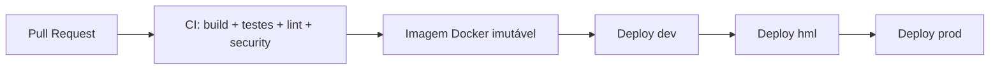

# Deploy & DevOps

> **Status:** Ativo · **Dono:** Plataforma · **Última atualização:** 2026-07-24

## Objetivo

Definir como o BeautyOS é construído, configurado e implantado com segurança e repetibilidade,
seguindo os princípios **12-Factor App**.

## Contexto

Aplicação empacotada em **Docker**, pipeline em **GitHub Actions**, três ambientes
(**dev / hml / prod**). O objetivo é paridade entre ambientes e deploy previsível do monólito
modular ([overview](../architecture/overview.md)).

## Responsabilidades

- **CI:** build, testes ([testing](../testing/testing-strategy.md)), lint e verificação de segurança.
- **CD:** promover artefato imutável entre ambientes com migrações controladas.

## Processos em execução

O ambiente local (`docker-compose.yml`) sobe os processos que também existem em produção:

| Processo | Comando | Papel |
|---|---|---|
| `backend` | `gunicorn` / `runserver` | API HTTP. |
| `worker` | `celery -A config worker --beat` | Relay assíncrono do Outbox ([events](../architecture/events.md)). |
| `db` | PostgreSQL | Dados + RLS. |
| `redis` | Redis | Broker do Celery / cache. |

> Em produção, **beat** (agendador) e **worker** costumam ser processos separados; no dev usamos
> `--beat` embutido por simplicidade. Portas do host são configuráveis (`DB_PORT`, `BACKEND_PORT`,
> `REDIS_PORT`).

## Ambientes

| Ambiente | Propósito | Dados |
|---|---|---|
| **dev** | Desenvolvimento/integração contínua. | Sintéticos. |
| **hml** | Homologação/validação de release. | Anonimizados. |
| **prod** | Produção. | Reais (LGPD). |

## Pipeline (visão)

## Princípios 12-Factor (aplicação)

- **Config no ambiente** (variáveis/secrets em cofre), nunca no código.
- **Build, release, run** separados; artefato imutável promovido entre ambientes.
- **Processos stateless**; estado no PostgreSQL/Redis.
- **Paridade** dev/hml/prod; **logs** como fluxo de eventos ([observabilidade](../observability/observability.md)).
- **Processos administrativos** (migrações) como jobs versionados.

## Boas práticas

- Migrações em **expand/contract** para deploy sem downtime.
- _Rollback_ por reimplantar artefato anterior; migrações reversíveis.
- Segredos gerenciados por cofre; rotação periódica ([segurança](../security/security.md)).
- CI barra merge com teste/segurança vermelhos.

## Más práticas

- ❌ Config/segredo hardcoded na imagem.
- ❌ Deploy sem migração revisada (ou migração destrutiva em uma fase).
- ❌ Ambiente de hml com dados reais não anonimizados.

## Impacto

Pipeline confiável reduz risco de release e habilita entrega frequente; custo: manutenção de
IaC e disciplina de migração.

## Evolução futura

- **IaC** (Terraform) para os ambientes.
- Estratégias de _blue-green_/_canary_ e feature flags.
- Autoscaling horizontal do monólito e workers por fila.

## Referências

- [The Twelve-Factor App](https://12factor.net/) · [Observabilidade](../observability/observability.md)
- [Estratégia de Testes](../testing/testing-strategy.md) · [Segurança](../security/security.md)
