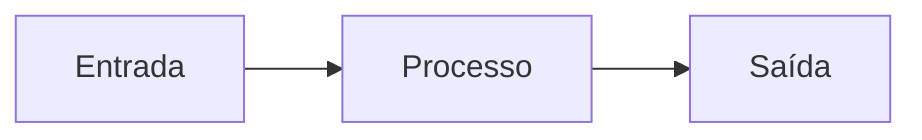

# <Título do documento>

> [!info] Metadados
> Preencha o **frontmatter** acima. Se este documento for a fonte única de verdade (SSOT) de um
> conceito, declare aqui: `**SSOT:** este é o único documento que define <conceito>.`

## Objetivo

Uma frase: o que este documento resolve e para quem.

## Contexto

Por que existe, o problema que endereça, restrições relevantes. Vincule ao contexto pai (ex.:
[MOC da área](../_MOC.md)).

## Responsabilidades

Quem/o quê é responsável. Deixe claro o que **não** é responsabilidade deste documento/módulo.

## <Conteúdo técnico>

Corpo do documento. Use **Mermaid** para diagramas:

Use **callouts** para destacar:

> [!warning] Ponto de atenção
> Explique riscos ou pré-condições importantes.

## Exemplos

Casos concretos — código, payloads, cenários de uso.

## Boas práticas

- O que fazer. Padrões recomendados.

## Más práticas

- ❌ Anti-padrões a evitar, com o porquê.

## Decisões arquiteturais

Links para os [ADRs](../decisions/README.md) que embasam este documento.

## Impacto

Consequências em escalabilidade, segurança, performance, custo e manutenção.

## Evolução futura

O que muda quando escalarmos; próximos passos conhecidos.

## Relacionados

Links para documentos irmãos (o Obsidian gera os **backlinks** automaticamente a partir daqui).

## Referências

- Links internos e externos (padrões, RFCs, documentação oficial).

<!--
NOTAS DE USO (remover ao criar o documento):
- Nome de arquivo em kebab-case.md; ADRs em NNNN-titulo.md.
- Respeite a política SSOT: referencie o dono do conceito, não copie a definição.
- Ao adicionar o 2º documento de uma área, crie o _MOC.md dela e ligue ao MOC raiz (docs/_MOC.md).
- Convenções completas: ../CONTRIBUTING-DOCS.md
-->
