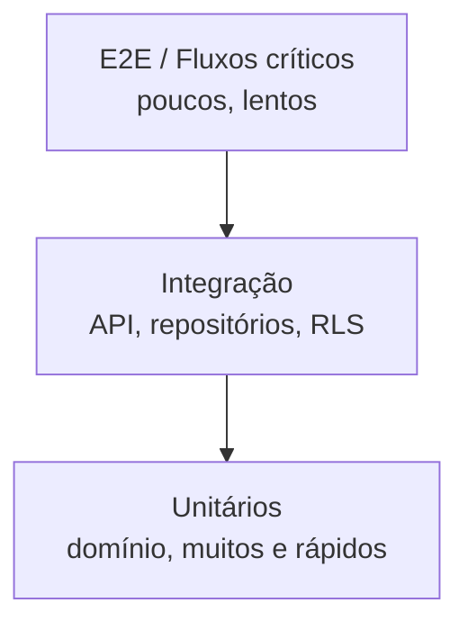

# Estratégia de Testes

> **Status:** Rascunho estruturado · **Dono:** Engenharia · **Última atualização:** 2026-07-24

## Objetivo

Definir o que testamos e como, garantindo confiança para evoluir o BeautyOS rapidamente sem
regressões — com atenção especial ao **isolamento multi-tenant**.

## Contexto

Testes são requisito de entrega ([checklist de feature](../../.claude/checklists/feature.md)).
A pirâmide equilibra velocidade (unit) e confiança (integração/e2e).

## Responsabilidades

- **Domínio:** testes unitários de invariantes de agregado.
- **Aplicação:** testes de casos de uso (com repositórios reais/fakes).
- **Interface/API:** testes de contrato e de autorização.

## Pirâmide de testes

| Camada | Foco | Volume |
|---|---|---|
| Unitário | Regras de domínio, cálculos (comissão, total). | Muitos |
| Integração | API + banco (inclui **teste de RLS/tenant**). | Médio |
| Contrato | Conformidade com o OpenAPI ([api](../api/api_guidelines.md)). | Médio |
| E2E | Fluxos críticos (agendar → atender → cobrar). | Poucos |

## Testes obrigatórios de multi-tenant

- Requisição no tenant A **não** enxerga dados do tenant B (aplicação **e** RLS).
- Falta de `tenant_id` de sessão bloqueia acesso (nega, não vaza).
- Escalonamento de privilégio negado por RBAC ([segurança](../security/security.md)).

## Boas práticas

- Cobrir invariantes e caminhos de erro, não só o caminho feliz.
- Dados de teste isolados por tenant; _factories_ com `tenant_id`.
- Metas de cobertura por criticidade (financeiro/segurança mais altas), não número único mágico.
- CI bloqueia merge com testes vermelhos ([deploy](../devops/deploy.md)).

## Más práticas

- ❌ Testar só o caminho feliz.
- ❌ Testes dependentes de ordem/estado global.
- ❌ Mockar o banco a ponto de não exercitar a RLS.

## Impacto

Rede de segurança que permite refatorar e extrair serviços com confiança; custo: manutenção da
suíte e tempo de CI.

## Evolução futura

- Testes de carga por tenant e de _noisy neighbor_.
- Testes de contrato consumidor-dirigido para integrações do Marketplace.
- Mutation testing em módulos críticos.

## Referências

- [Diretrizes de API](../api/api_guidelines.md) · [Segurança](../security/security.md)
- [Multi-Tenant](../architecture/multi-tenant.md)
